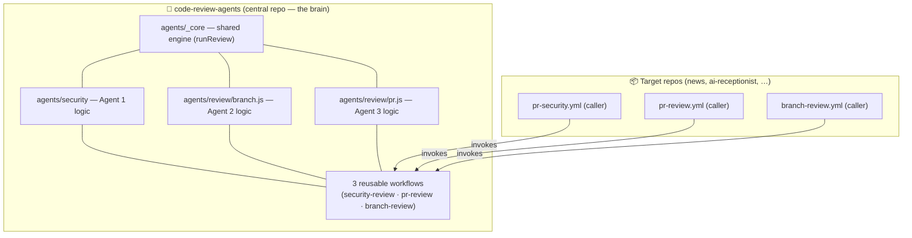
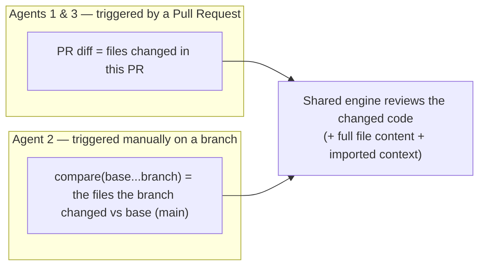
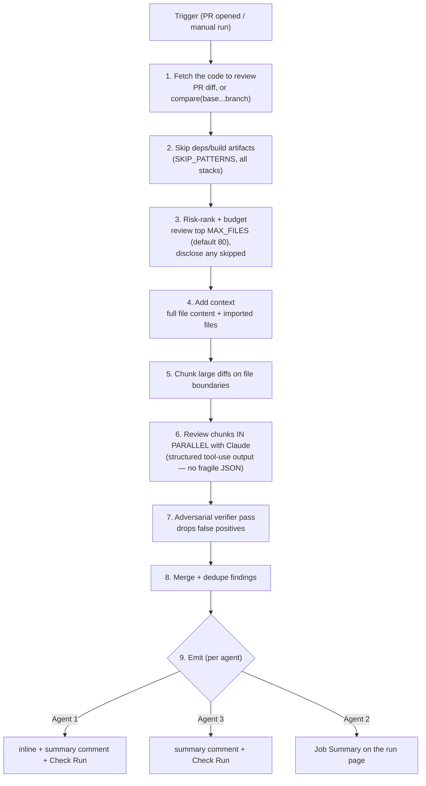
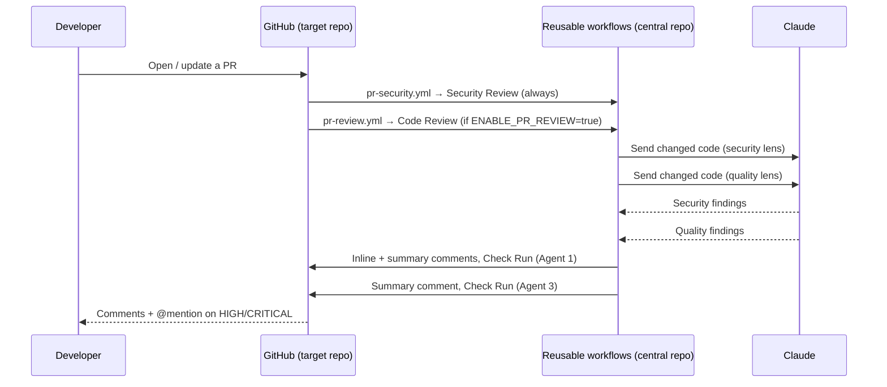
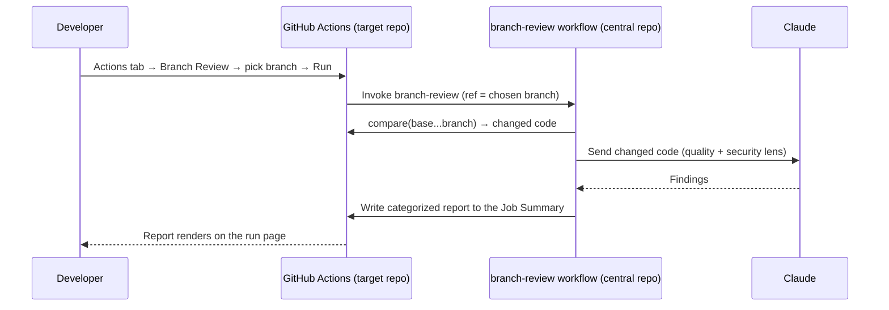
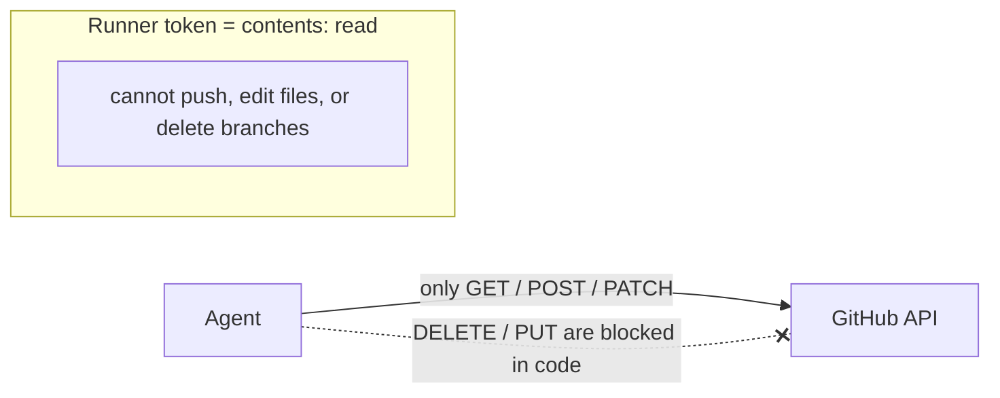

# How the Review Agents Work

A plain-English + diagram guide to the three code-review agents — what triggers them, **what code each one reviews**, and what happens behind the scenes. No prior knowledge of the codebase required.

---

## 1. The big picture

There is **one central repo** (`code-review-agents`) that holds all the logic, and **many target repos** that each add a tiny "caller" file. The target repos contain *no* review logic — they just call the central one. Fix the logic once, every repo benefits.



ASCII version of the same idea:

```
   code-review-agents (central)              target repo (e.g. ai-receptionist)
   ┌───────────────────────────┐            ┌──────────────────────────────┐
   │ agents/_core  (engine)     │  ◀───────  │ .github/workflows/           │
   │ agents/security (Agent 1)  │   calls    │   pr-security.yml   (Agent 1)│
   │ agents/review   (Agents 2,3)│           │   pr-review.yml     (Agent 3)│
   │ 3 reusable workflows        │           │   branch-review.yml (Agent 2)│
   └───────────────────────────┘            └──────────────────────────────┘
```

---

## 2. The three agents at a glance

| | **Agent 1 — Security** | **Agent 2 — Branch Review** | **Agent 3 — PR Review** |
|---|---|---|---|
| **When it runs** | Automatically on every PR | Manually (Actions tab) | Automatically on every PR |
| **What code it reviews** | The **PR diff** (files changed in the PR) | The **files the branch changed vs the base branch** (the branch's diff — *not* the whole codebase) | The **PR diff** (files changed in the PR) |
| **What it looks for** | Security vulnerabilities only | Everything: bugs, performance, design **+ security** | Quality only: bugs, performance, design (**no** security) |
| **Where results go** | Inline comments **+** summary comment **+** Check Run | **Job Summary** on the Actions run page | One summary comment **+** Check Run |
| **On/off** | Always on | Manual (run when you want) | Per-repo toggle: variable `ENABLE_PR_REVIEW=true` |
| **Default model** | Sonnet | Sonnet | Sonnet |

> **Why Agent 3 skips security:** Agent 1 already reviews every PR for security, so Agent 3 focuses purely on code quality to avoid duplicate findings.

---

## 3. What code does each agent actually read?

This is the key question. All three use the same engine, but feed it a different slice of code:



In all cases the engine:
- pulls the **full content of each changed file** (not just the diff lines) so the model has context,
- pulls in **unchanged dependency files the changed code references** for cross-file data-flow context — **language-aware**: Swift type references → `<Type>.swift`, Kotlin/Java `import a.b.C` → that file, JS/TS relative imports — all resolved against the repo's file tree (fetched once via the git-trees API),
- applies **per-language pitfall lenses** (Swift/Kotlin/Node/TS) so the prompt targets each ecosystem's real failure modes,
- and **skips dependency/build artifacts** automatically (next section).

> **Agent 2 is the branch's *diff* vs base, not the entire branch codebase.** Files the branch didn't touch are not reviewed. Two caps apply: GitHub's compare API returns at most **300 changed files** (and omits the patch for very large files), and the engine's `MAX_FILES` budget (default 80) reviews the highest-risk files and discloses the rest.

### What is always skipped (never reviewed)

Dependency and build output for **every** tech stack — so a 14 GB repo might only have ~8 MB of real source to review:

```
node_modules/   Pods/   Carthage/   DerivedData/   .gradle/   .cxx/
target/(debug|release)/   .build/   vendor/   bin/   obj/   .venv/  __pycache__/
dist/  build/  out/  .next/  coverage/  .expo/   patches/
*.lock (package-lock, yarn.lock, pnpm-lock, Podfile.lock, …)
*.min.js / *.min.css   and all binaries/media/fonts (png, pdf, zip, woff, mp4, …)
```

Your own source — including a top-level `modules/` of custom native code — is **always** reviewed.

---

## 4. Behind the scenes — the shared pipeline

Every agent runs the same engine (`runReview`). Here's what happens from trigger to result:



### Each step in plain English

1. **Trigger** — Someone opened/updated a PR (Agents 1 & 3), or clicked **Run** on a branch (Agent 2). GitHub spins up a temporary runner and starts the agent.
2. **Fetch the code to review** — The agent asks GitHub for *what changed*: the PR's diff (Agents 1 & 3) or the branch-vs-base diff (Agent 2), along with the list of changed files. (It only ever looks at changes — never the whole repo.)
3. **Skip deps/build artifacts** — It throws away anything that isn't your source code — `node_modules`, `Pods`, build output, lockfiles, images, etc. — so the model only spends effort on real code.
4. **Risk-rank + budget** — If more files changed than the budget (`MAX_FILES`, default 80), it sorts them by how likely they are to contain problems (security-sensitive names + being actual code rank highest), reviews the top ones, and **lists any it skipped** so nothing is hidden.
5. **Add context** — For each file it will review, it also pulls the **full file content** (not just the changed lines) and the **files that file imports**, so the model can understand the change instead of guessing. (See §3's `buildQuery` example.)
6. **Chunk large diffs** — If it's all too big to send in one request, it splits the payload into chunks **on whole-file boundaries** (it never cuts a file in half).
7. **Review chunks in parallel with Claude** — Chunks are sent to Claude several at a time (faster). Claude must reply in a **strict structured format** (a "tool call"), so there's no fragile text-parsing that could silently drop findings.
8. **Verifier pass** — A *second* Claude call re-examines each finding and tries to **disprove** it. Anything that looks like a false alarm is dropped before you ever see it.
9. **Merge + dedupe** — Findings from all chunks are combined, duplicates removed, and sorted by severity (CRITICAL first).
10. **Emit (per agent)** — Results are posted where that agent puts them: **Agent 1** → inline comments + summary comment + Check Run; **Agent 3** → summary comment + Check Run; **Agent 2** → a report on the Actions run page (Job Summary). Each result also shows a small **cost line** — e.g. *Reviewed with `claude-sonnet-4-6` · 14k in / 3k out · est. $0.09* — so you can see what each review actually cost.

Key robustness behaviours built into the pipeline:
- **Parallel chunks** — large diffs are reviewed several chunks at a time (faster).
- **Verifier pass** — a second Claude call tries to *refute* each finding; false positives are dropped before you ever see them.
- **Honest failure** — if *some* chunks fail, it posts results **plus** a "partial review" warning; if *all* chunks fail (e.g. API outage), it posts an **error** comment and never a false "no issues found."
- **Idempotent** — re-runs **update** the existing comment in place (never duplicate-spam, never delete).

---

## 5. End-to-end: opening a Pull Request

When someone opens/updates a PR (with Agent 3 enabled), Agents 1 and 3 run independently and in parallel:



---

## 6. End-to-end: a manual Branch Review (Agent 2)



---

## 7. Safety — what the agents can and cannot do

The agents are **read-and-comment only**. They can never change your code or repo. This is enforced two independent ways:



| Guard | Effect |
|-------|--------|
| Workflow token is `contents: read` | The token **physically cannot** push code, edit files, or delete branches |
| `githubRequest` allows only GET/POST/PATCH | DELETE and PUT throw — agents can't delete code, branches, PRs, or even comments |
| Comments update in place | Re-runs edit the existing comment — no deletion, no spam |
| Advisory only | Findings are posted as a **neutral** Check Run — never blocks a merge |

> Two tokens, clear split: a `GH_PAT` is used **only** to check out the central agent code; all review API calls use the built-in, minimally-scoped Actions token.

---

## 8. Configuration cheat-sheet

| Want to… | Do this |
|----------|---------|
| Turn Agent 3 on for a repo | Set repo **variable** `ENABLE_PR_REVIEW = true` |
| Change an agent's model | Add `model: 'claude-…'` under `with:` in that repo's caller |
| Change who gets @-mentioned | `notify_users: 'alice,bob'` in the caller (PR author is always mentioned) |
| Limit huge PRs | env `MAX_FILES` (default 80) — top-risk files reviewed, rest disclosed |
| Reduce inline noise | env `INLINE_MIN_SEVERITY=MEDIUM` |
| Hide speculative findings | env `MIN_CONFIDENCE=MEDIUM` — low-confidence findings suppressed (disclosed) |
| Harden HIGH/CRITICAL verdicts | env `VERIFY_HIGH_STAKES_VOTES=3` — majority-vote verify on high-severity findings |
| Turn off the verifier (cheaper/faster) | env `VERIFY=false` |
| Test agent changes before merging | caller `with:` `agent_ref: <branch>` (defaults to `main`) |

> Today the `env` knobs above are read by the engine but not auto-forwarded from repo variables — override them in the `env:` block of the reusable workflow. `agent_ref`/`model`/`notify_users` are settable directly from the caller.

Models available: `claude-opus-4-8`, `claude-opus-4-7`, `claude-sonnet-4-6`, `claude-haiku-4-5`, `claude-fable-5`.

---

*For implementation details and contributor rules, see [`CLAUDE.md`](../CLAUDE.md). For setup steps, see [`README.md`](../README.md).*
